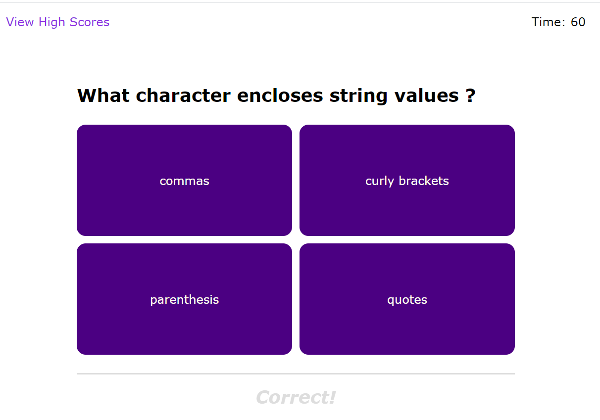
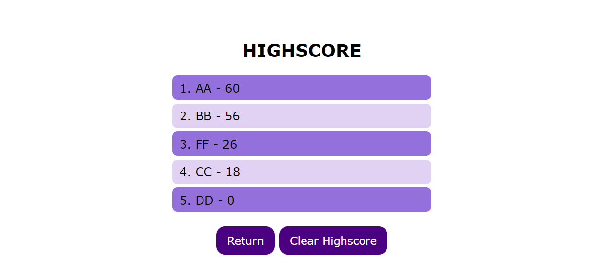

# Code Quiz

Link: https://meemofu.github.io/quiz-challenge/

## Preview:

## Features

1. Randomized questions order. The questions will be picked randomly from an array of question. The current ver only 6 question, but more questions can be added easily as an object in the question array

2. Some animation for the buttons and result that fades out

3. Automatically keep track of previous score and insert next scores in the correct order

4. Highscore history can be cleared on its page